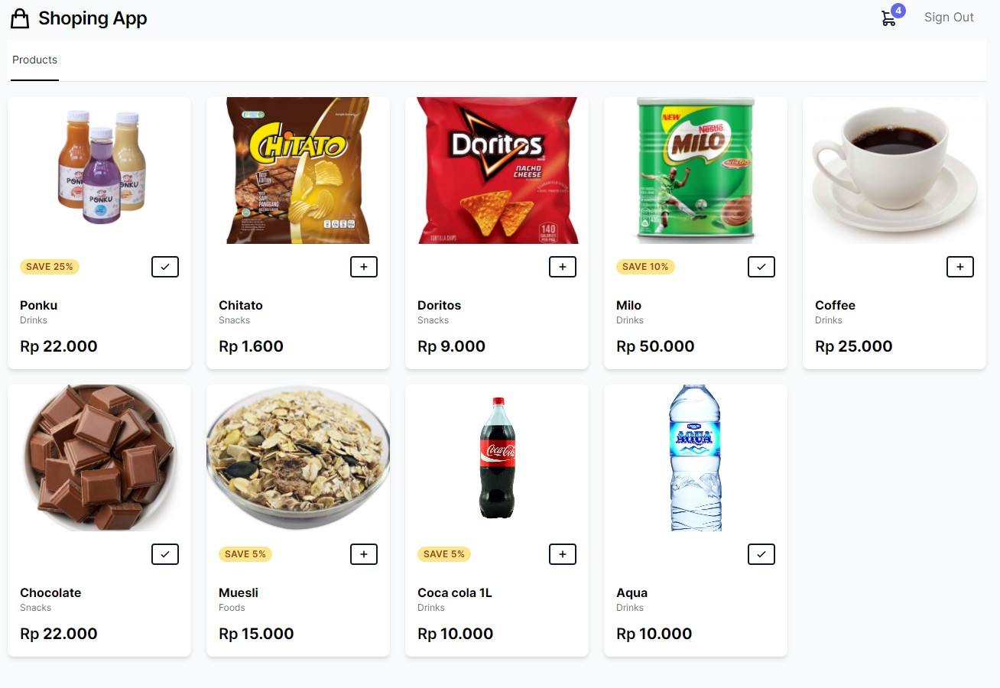
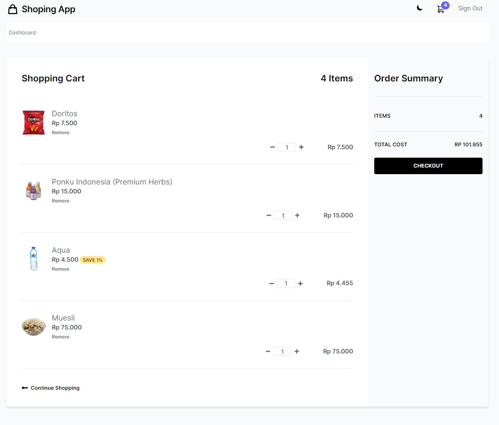
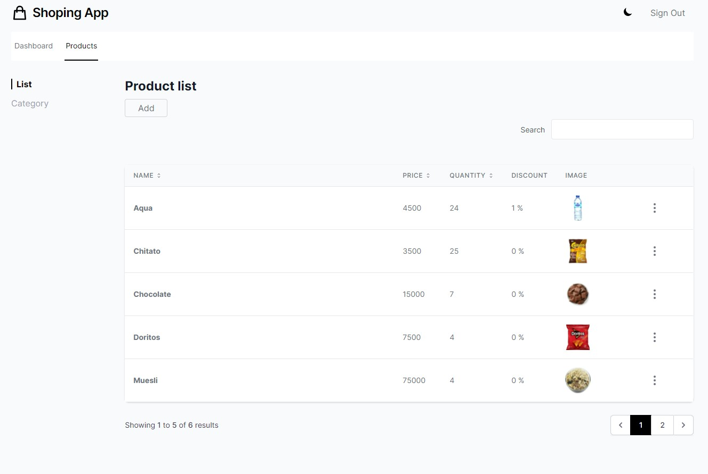

## Tech stack

 User role = [
  'admin' => 1,
  'user' => 2
 ]
  

- [Laravel](https://laravel.com/)

- [Laravel-livewire](https://laravel-livewire.com/)

- [Turbolinks](https://github.com/turbolinks/turbolinks)

- [TailwindCss](https://tailwindcss.com/)

- [AlpineJS](https://github.com/alpinejs/alpine)

  

## How to run ?
Guide from  [devmarketer.io](https://devmarketer.io/learn/setup-laravel-project-cloned-github-com/) thanks to him.

## Screenshot

-products

-cart

-crud

