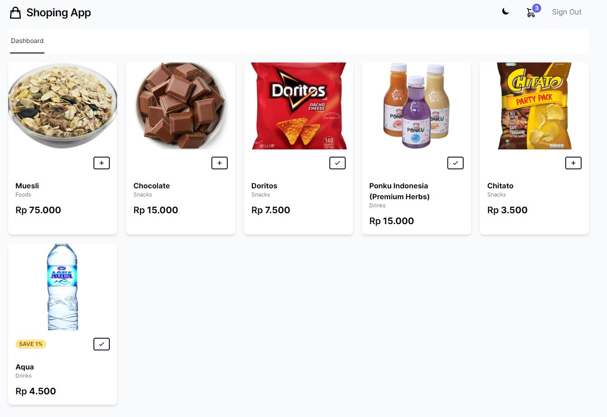

  
  

## Tech stack

  
  

User role = [

'admin' => 1,

'user' => 2

]

  

-  [Laravel](https://laravel.com/)

  

-  [Laravel-livewire](https://laravel-livewire.com/)

  

-  [Turbolinks](https://github.com/turbolinks/turbolinks)

  

-  [TailwindCss](https://tailwindcss.com/)

  

-  [AlpineJS](https://github.com/alpinejs/alpine)

 -  [Intervention Image](https://github.com/Intervention/image)*

 *Read the requirements

## How to run ?

- git clone https://github.com/ultramenid/Larawire---shop.git

- composer install

- npm install

- cp .env.example .env

- php artisan key:generate

- php artisan migrate

- php artisan db:seed

- php artisan storage:link

  
  

## Screenshot

  

-products

  

-cart

  

-crud

